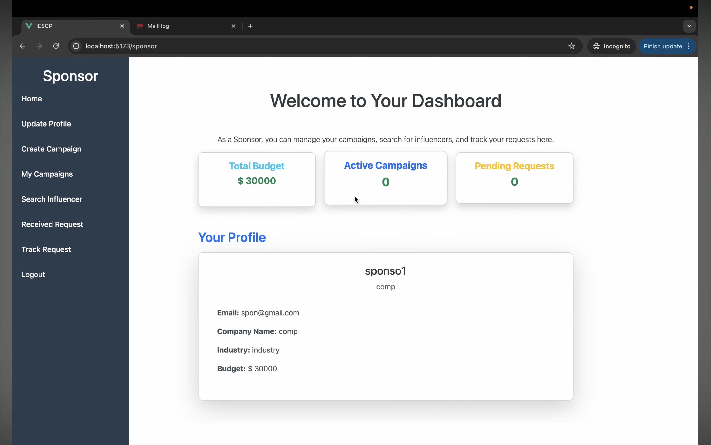
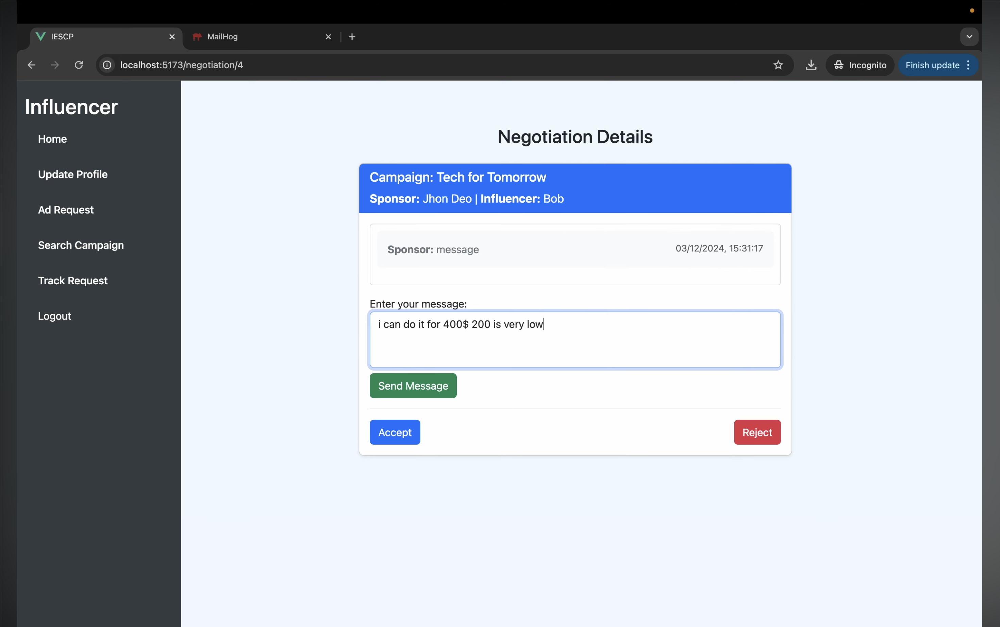

# Influencer Engagement and Sponsorship Coordination Platform

A full-stack web application that connects sponsors and influencers for campaign collaboration, ad request management, and sponsorship coordination.

Built using Flask and Vue.js with support for background task processing, caching, and report generation.

---

## Overview

This project was developed as part of the IIT Madras BS Degree coursework to understand full-stack application development and scalable backend architecture.

The platform allows sponsors to create campaigns and manage ad requests, while influencers can explore opportunities, accept collaborations, and manage sponsorship activities.

While building this project, I learned how frontend-backend communication works in real-world applications along with authentication, caching, asynchronous tasks, and database relationship management.

---

## Features

### Authentication & Authorization
- User authentication and login
- Role-based access control
- Separate dashboards for:
  - Admin
  - Sponsor
  - Influencer

### Sponsor Features
- Create and manage campaigns
- Create ad requests for influencers
- Track campaign performance
- Manage sponsorship collaborations

### Influencer Features
- View available campaigns
- Accept or reject sponsorship requests
- Manage influencer profile
- Track accepted campaigns

### Admin Features
- Monitor platform activity
- Manage users and campaigns
- Flag inappropriate campaigns or users

### Additional Features
- Redis caching for improved performance
- Celery background jobs
- Automated email notifications
- CSV report generation and download
- REST API architecture
- Dashboard analytics

---

## Tech Stack

### Frontend
- Vue.js
- Bootstrap
- JavaScript

### Backend
- Flask
- Flask REST APIs

### Database
- SQLite

### Background Processing
- Celery

### Caching
- Redis

---

## Project Structure

```text
project/
├── backend/
├── frontend/
├── celery_worker/
├── static/
├── templates/
└── reports/
```

---

## Screenshots

### Sponsor Dashboard


### Negotiation Chat


---

## Core Functionalities

### Campaign Management
Sponsors can:
- Create campaigns
- Set campaign goals
- Define budgets
- Manage visibility and status

### Ad Request System
Sponsors can send collaboration requests to influencers with:
- Requirements
- Payment details
- Campaign information

Influencers can:
- Accept requests
- Reject requests
- Track ongoing collaborations

### Background Tasks using Celery
Celery was used for:
- Sending scheduled emails
- Processing background jobs
- Generating CSV reports asynchronously

### Redis Caching
Redis was integrated to:
- Improve API response speed
- Reduce repeated database queries
- Optimize dashboard performance

### CSV Export
The platform supports CSV report downloads for:
- Campaign data
- Sponsorship details
- User activity reports

---

## Challenges I Faced

One of the biggest challenges was integrating Vue.js frontend with Flask backend APIs while handling authentication and protected routes.

I also learned how asynchronous task queues work while implementing Celery for email notifications and report generation.

Managing multiple user roles and maintaining proper database relationships between sponsors, campaigns, influencers, and ad requests helped me understand backend system design more deeply.

---

## What I Learned

- Full-stack application architecture
- REST API development using Flask
- Vue.js frontend integration
- Authentication and authorization
- Redis caching concepts
- Celery background task processing
- CSV report generation
- Database relationship management
- Role-based dashboard implementation

---

## Installation

### Clone Repository

```bash
git clone <repo-url>
cd project
```

### Backend Setup

```bash
cd backend
pip install -r requirements.txt
```

### Frontend Setup

```bash
cd frontend
npm install
npm run dev
```

### Start Redis

```bash
redis-server
```

### Start Celery Worker

```bash
celery -A app.celery worker --loglevel=info
```

### Run Flask Server

```bash
flask run
```

---

## Future Improvements

- Real-time chat system
- Payment gateway integration
- AI-based influencer recommendations
- Campaign analytics dashboard
- Docker deployment

---

## Contributors

- Tejas Patare
